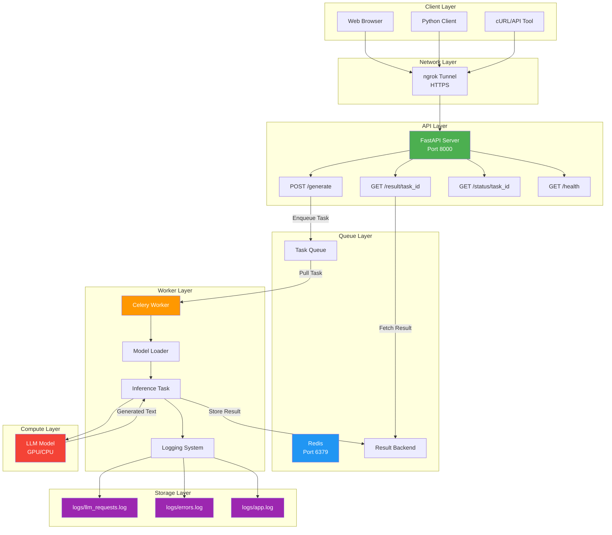
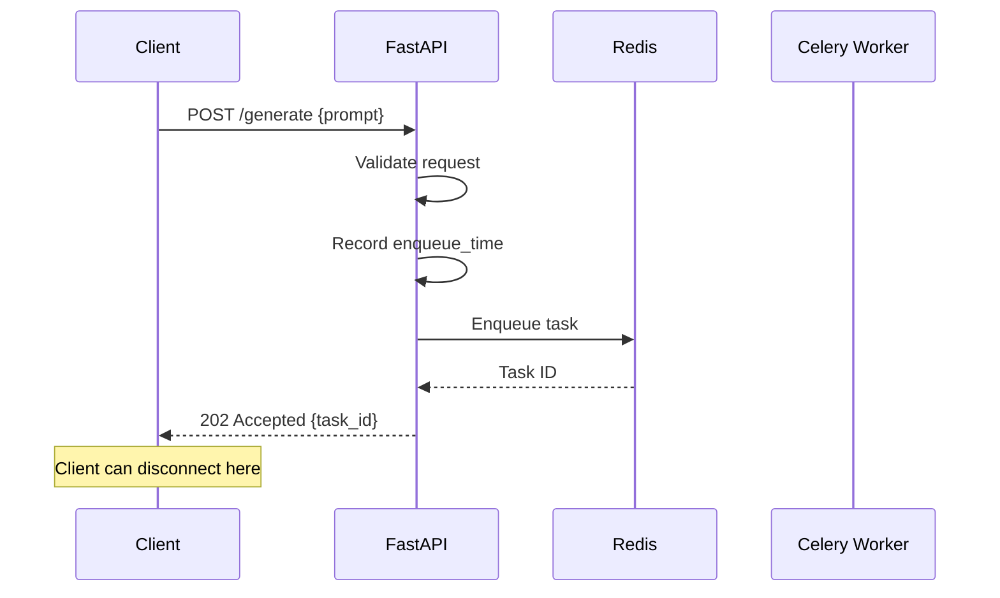
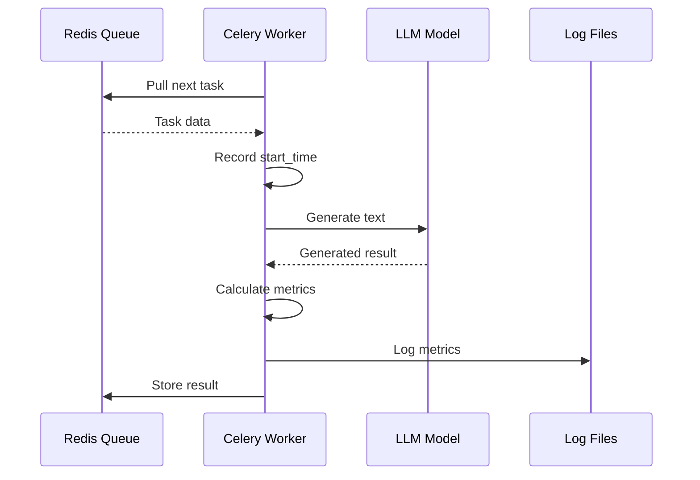
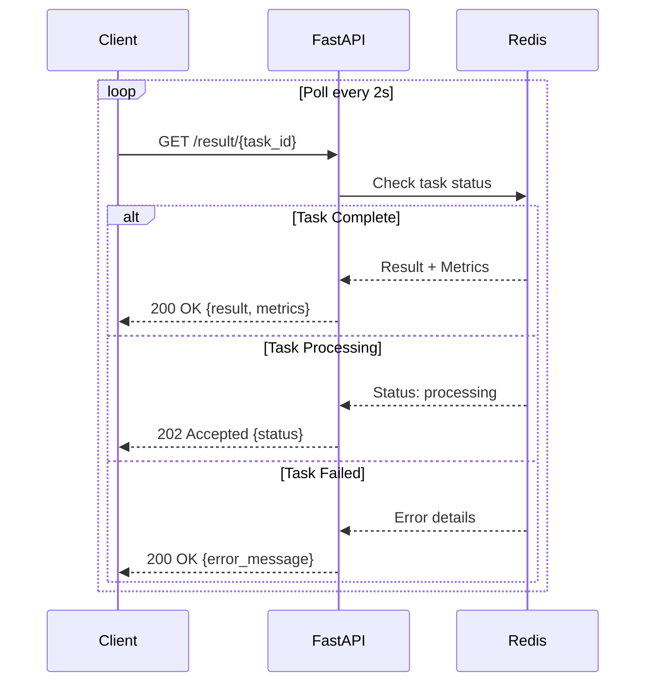
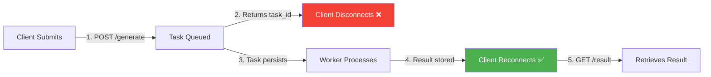
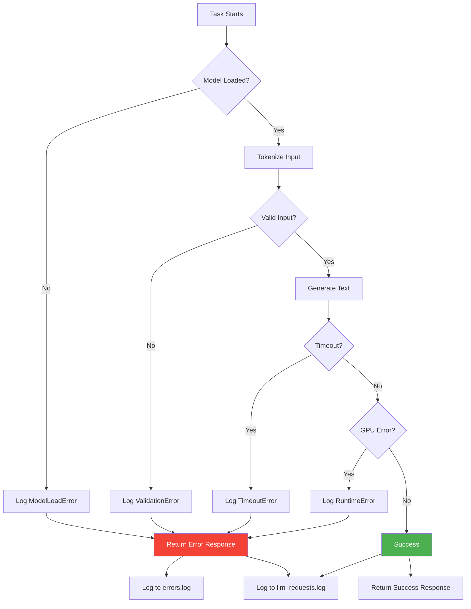
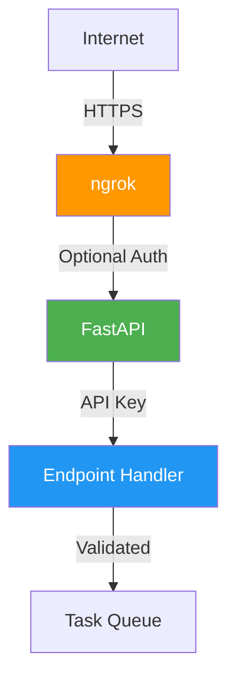

# LLM Inference System - Architecture Overview

## System Flow Diagram



## Request Flow

### 1. Submit Request



### 2. Process Task



### 3. Retrieve Result



## Component Responsibilities

### FastAPI Server
- ✅ Accept HTTP requests
- ✅ Validate input (Pydantic)
- ✅ Authenticate API keys
- ✅ Enqueue tasks to Celery
- ✅ Retrieve results from Redis
- ✅ Return appropriate HTTP responses

### Redis
- ✅ Store task queue (FIFO)
- ✅ Store task results (1 hour expiry)
- ✅ Persist data (survive restarts)
- ✅ Act as message broker

### Celery Worker
- ✅ Load LLM model (once at startup)
- ✅ Pull tasks from queue
- ✅ Run inference on GPU/CPU
- ✅ Calculate performance metrics
- ✅ Log all requests
- ✅ Handle errors gracefully
- ✅ Store results in Redis

### Logging System
- ✅ Log every request (success/failure)
- ✅ Record timing metrics
- ✅ Save error tracebacks
- ✅ Human-readable format

## Data Flow

### Request Object
```json
{
  "prompt": "Explain quantum computing",
  "max_tokens": 512,
  "temperature": 0.7,
  "top_p": 0.9,
  "user_id": "user123"
}
```

### Task Queue Entry
```python
{
  "task_id": "abc-123-def",
  "prompt": "Explain quantum computing",
  "max_tokens": 512,
  "temperature": 0.7,
  "top_p": 0.9,
  "enqueue_time": 1700000000.123
}
```

### Result Object
```json
{
  "status": "completed",
  "task_id": "abc-123-def",
  "result": "Quantum computing is...",
  "metrics": {
    "queue_wait_time": 2.3,
    "processing_time": 5.8,
    "total_time": 8.1,
    "prompt_tokens": 50,
    "completion_tokens": 200,
    "tokens_per_second": 34.48
  }
}
```

### Log Entry
```
[2025-11-21 15:30:45] task_id=abc-123-def status=success prompt_tokens=50 completion_tokens=200 tokens_per_sec=34.48 queue_wait=2.30s processing_time=5.80s total_time=8.10s
```

## Disconnect Resilience



**Key Point**: Once task is queued in Redis, it will complete regardless of client connectivity.

## Concurrent User Handling

```mermaid
gantt
    title Task Processing Timeline (3 Concurrent Users)
    dateFormat  ss
    axisFormat %S
    
    section User 1
    Queue Wait     :done, u1q, 00, 1s
    Processing     :active, u1p, after u1q, 10s
    
    section User 2
    Queue Wait     :crit, u2q, 01, 10s
    Processing     :active, u2p, after u2q, 10s
    
    section User 3
    Queue Wait     :crit, u3q, 02, 20s
    Processing     :active, u3p, after u3q, 10s
```



- **User 1**: Immediate processing (queue empty)
- **User 2**: Waits ~10s (User 1 processing)
- **User 3**: Waits ~20s (Users 1 & 2 processing)

All wait times logged in `llm_requests.log`.

## Error Handling Flow



## Monitoring Points

### Health Check
```bash
GET /health
```
Returns:
- Redis connection status
- Worker availability
- Model loaded status

### Log Files
- `logs/llm_requests.log` - All request metrics
- `logs/errors.log` - Error tracebacks
- `logs/app.log` - Application logs

### Optional: Flower Dashboard
```bash
http://localhost:5555
```
- Real-time task monitoring
- Worker status
- Task history
- Performance graphs

## Scalability

### Current Setup (Single GPU)
- 1 Celery worker
- Concurrency: 1
- Queue: Unlimited
- Handles: 2-3 concurrent users

### Future Scaling Options

1. **Multiple GPUs (Same Machine)**
   ```bash
   # Worker 1 (GPU 0)
   CUDA_VISIBLE_DEVICES=0 celery -A app.celery_app worker
   
   # Worker 2 (GPU 1)
   CUDA_VISIBLE_DEVICES=1 celery -A app.celery_app worker
   ```

2. **Distributed Workers (Multiple Machines)**
   - Same Redis instance
   - Workers on different machines
   - Automatic load balancing

3. **Load Balanced API**
   - Multiple FastAPI instances
   - nginx load balancer
   - Shared Redis backend

## Security Layers



1. **ngrok** - HTTPS encryption
2. **API Key** - Authentication
3. **Input Validation** - Pydantic models
4. **Rate Limiting** - (Optional, can be added)

## File Structure Summary

```
📁 LLM Inference System/
├── 📁 app/                      # Application code
│   ├── main.py                  # FastAPI endpoints
│   ├── celery_app.py            # Celery config
│   ├── config.py                # Settings
│   ├── models.py                # Pydantic models
│   ├── auth.py                  # Authentication
│   └── 📁 tasks/
│       └── inference.py         # LLM task
├── 📁 logs/                     # Auto-generated logs
│   ├── llm_requests.log         # Request metrics
│   ├── errors.log               # Error tracebacks
│   └── app.log                  # Application logs
├── 📁 tests/                    # Test suite
│   └── test_api.py              # API tests
├── requirements.txt             # Dependencies
├── .env.example                 # Config template
├── docker-compose.yml           # Redis setup
├── README.md                    # Documentation
├── client_example.py            # Python client
├── quick_test.py                # Test script
└── start.bat                    # Startup script
```

## Technology Stack

| Component | Technology | Purpose |
|-----------|-----------|---------|
| API Framework | FastAPI | REST endpoints |
| Task Queue | Celery | Background processing |
| Message Broker | Redis | Task queue & results |
| LLM Framework | Transformers | Model inference |
| GPU Support | PyTorch + CUDA | Acceleration |
| Validation | Pydantic | Input/output validation |
| Testing | pytest | Unit/integration tests |
| Monitoring | Flower (optional) | Task monitoring |
| Tunneling | ngrok | Remote access |

## Performance Metrics

### Tracked Metrics
- ⏱️ **Queue Wait Time** - Time in queue before processing
- ⚡ **Processing Time** - Actual inference duration
- 🕐 **Total Time** - End-to-end latency
- 📝 **Prompt Tokens** - Input token count
- 📄 **Completion Tokens** - Output token count
- 🚀 **Tokens/Second** - Generation speed

### Logged For Every Request
```
✅ Success → All metrics + result
❌ Failure → Error message + traceback
```

## Summary

This architecture provides:
- ✅ **Reliability** - Tasks survive disconnects
- ✅ **Scalability** - Easy to add more workers
- ✅ **Observability** - Comprehensive logging
- ✅ **Performance** - GPU acceleration
- ✅ **Security** - API key authentication
- ✅ **Maintainability** - Clean code structure
- ✅ **Testability** - Full test suite
- ✅ **Documentation** - Complete guides

**Production-ready for 2-3 concurrent users with room to scale!** 🚀
